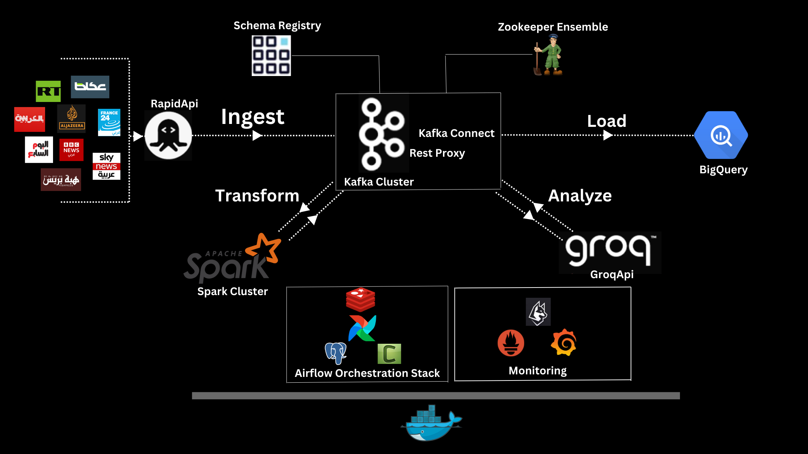

# Arabic_News_Data_Engineering_project
This project implements a scalable ETL pipeline to extract and process Arabic news content from over 9 sources including `Al Jazeera`, `BBC Arabic`, `CNN Arabic`, and `RT Arabic` via `RapidAPI`, loading the data into Google BigQuery using a modern data engineering stack.

## Architecture 
 <!-- Add actual diagram path -->


## Technologies
| Component          | Technology Stack          |
|--------------------|---------------------------|
| Data Ingestion     | `Kafka Cluster`, `RapidAPI`           |
| Data Processing    | `PySpark`, `Spark Cluster`    |
| NLP                | `Llama 3.1-8B` + `Custom Function Calling via GROQ API (Topic Classification, Geolocation, Entity Recognition)`    |
| Data Warehouse          | `BigQuery`                  |
| Orchestration      | `Airflow`, `Celery`           |
| Monitoring         | `Conduktor`, `Prometheus & Grafana`, `Spark UI`, `Airflow UI`      |
| Infrastructure     | `Docker`, `Make`              |
## Prerequisites
- Docker & Docker Compose
- Make (optional)
- API Keys:
  - [RapidAPI](https://rapidapi.com/)
  - [GROQ API](https://groq.com/)
  - GCP Service Account Key
## Setup
Clone repository:
 ```bash
 git clone https://github.com/hassanInfo/Arabic_News_Data_Engineering_project.git
 cd Arabic_News_Data_Engineering_project
 ```
Update the following environment variables in the compose.yml file:
   ```bash
   AIRFLOW__SMTP__SMTP_HOST=your_smtp_host
   AIRFLOW__SMTP__SMTP_USER=your_smtp_user
   AIRFLOW__EMAIL__FROM_EMAIL=your_email
   X_RAPID_API_KEY=your_rapidapi_key
   GROQ_API_KEY=your_groq_key
   ```
Google Cloud Setup:
 1. Create a GCP Service Account and download the key file.
 2. Place the key file as `keyfile.json` in the `./kafka/config/` directory.
 3. Create a BigQuery dataset named `bq_kafka_dataset`.
 4. Grant the necessary permissions to the Service Account.
ETL Configuration
  Configure: `./etl/config/config.yaml`.
## Startup
```bash
# Choose service profile
make up_build PROFILE=all 
```